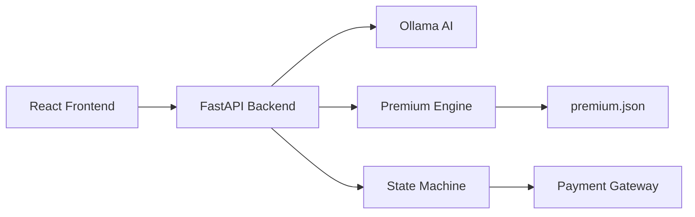

# 🚀 eTouch II Insurance System - Complete Setup Guide

A modern insurance agent system with AI-powered conversations and ChatGPT-like interface.

## 📋 What You're Getting

✅ **AI Insurance Agent** - Meet EtouchAgent, your friendly insurance consultant  
✅ **ChatGPT-like Interface** - Modern, responsive React frontend  
✅ **Comprehensive Premium Engine** - Real actuarial calculations  
✅ **Dynamic Forms** - Smart form generation based on conversation flow  
✅ **External Payment Integration** - Ready for payment gateway connection  
✅ **Document Upload** - KYC and document processing  
✅ **Real-time Progress Tracking** - Visual progress indicators  

---

## 🎯 Quick Start (5 minutes)

### 1. **Install Ollama & Model**
```bash
# Download from: https://ollama.ai/
# Then install a model:
ollama pull llama3
ollama serve  # Keep this running
```

### 2. **Backend Setup**
```bash
cd etouch-backend
pip install -r requirements.txt
python -m app.main
```
✅ Backend running at `http://localhost:8000`

### 3. **Frontend Setup**
```bash
cd frontend
npm install
npm start
```
✅ Frontend running at `http://localhost:3000`

### 4. **Test the System**
- Open `http://localhost:3000`
- Start chatting with EtouchAgent!
- Try: "I want life insurance for my family"

---

## 🏗️ Architecture Overview



### **State Flow**
```
Start → Onboarding → Eligibility Check → Quote Generation → Payment Redirect
```

---

## 🎨 Frontend Features

### **ChatGPT-like Interface**
- **Message Bubbles** - User and agent messages with avatars
- **Typing Indicators** - Realistic conversation feel
- **Progress Tracking** - Visual completion indicators
- **Responsive Design** - Works on mobile and desktop

### **Dynamic Components**
- **Smart Forms** - Generated based on backend state
- **Quote Comparison** - Interactive insurance plan selection
- **Document Upload** - Drag-and-drop file handling
- **Payment Integration** - External gateway redirection

### **React Architecture**
```
src/
├── components/
│   ├── Chat/
│   │   ├── ChatInterface.tsx       # Main chat container
│   │   ├── MessageBubble.tsx       # Individual messages
│   │   ├── TypingIndicator.tsx     # Loading animation
│   │   ├── InputArea.tsx           # Message input
│   │   └── ActionRenderer.tsx      # Dynamic actions
│   └── Forms/
│       ├── DynamicForm.tsx         # Form generator
│       ├── QuoteDisplay.tsx        # Insurance quotes
│       ├── PaymentRedirect.tsx     # Payment UI
│       ├── FileUpload.tsx          # Document upload
│       └── OptionsSelection.tsx    # Multiple choice
├── hooks/
│   └── useChat.ts                  # Chat state management
├── services/
│   └── api.ts                      # Backend integration
└── types/
    └── chat.ts                     # TypeScript definitions
```

---

## 🧠 Backend Intelligence

### **AI Agent - EtouchAgent**
```python
# Each state has specialized prompts:
"You are EtouchAgent, a friendly insurance agent with 10+ years experience..."
```

**Personality Traits:**
- 🤝 Warm and trustworthy
- 🎓 Expert knowledge of eTouch II
- 💡 Proactive suggestions
- 🛡️ Family protection focused

### **Premium Engine**
```json
{
  "base_rates": {
    "Life Shield": {
      "age_bands": {
        "18-25": { "male": 1.20, "female": 1.05 },
        "26-30": { "male": 1.35, "female": 1.18 }
      }
    }
  },
  "adjustments": {
    "tobacco_usage": { "non_tobacco": 1.0, "tobacco": 1.75 },
    "occupation_categories": { /* 4 risk classes */ },
    "discounts": { /* 8+ discount types */ }
  }
}
```

### **State Machine**
```python
class OnboardingState(BaseState):
    required_fields = ["full_name", "email", "mobile_number", ...]
    
    async def process_message(self, session, user_message, form_data):
        # Smart conversation handling
        # Dynamic form generation  
        # Automatic state transitions
```

---

## 💰 Premium Calculation Engine

### **Real Actuarial Logic**
The system uses comprehensive premium tables with:

- **Age & Gender Bands** - 9 age groups, gender-specific rates
- **Risk Adjustments** - Tobacco, occupation, health conditions  
- **Policy Term Factors** - Longer terms get discounts
- **Sum Assured Bands** - Higher coverage gets better rates
- **8+ Discount Types** - Online, female, non-tobacco, loyalty, etc.

### **Example Calculation**
```python
# For 35-year-old male, non-tobacco, Life Shield Plus
base_rate = 2.05  # From age band
policy_factor = 1.0  # 20-year term  
tobacco_factor = 1.0  # Non-tobacco
occupation_factor = 1.0  # Office worker
discounts = 0.16  # 16% total discounts

final_premium = base_rate * factors - discounts
```

---

## 🎭 Agent Persona - "EtouchAgent"

### **Conversation Examples**

**Onboarding:**
> "Hi! I'm EtouchAgent, your insurance agent with 10+ years at Bajaj Allianz. I'm here to help you protect your family with our eTouch II plan..."

**Quote Generation:**  
> "For just ₹2,500 per month, your family gets ₹1 crore protection! That's less than your coffee budget for complete peace of mind..."

**Payment:**
> "Congratulations! You're making one of the smartest financial decisions today. Your family's future is now secure! 🎉"

### **Agent Intelligence**
- Contextual responses based on customer profile
- Proactive suggestions and explanations
- Handles objections naturally
- Celebrates customer milestones

---

## 🔄 API Integration

### **Chat Endpoint**
```typescript
POST /api/chat/message
{
  "session_id": "uuid",
  "message": "I want insurance",
  "form_data": { "name": "John", "age": 35 }
}

// Returns:
{
  "message": "Great choice, John! Let me show you our plans...",
  "actions": [
    {
      "type": "quote_display",
      "variants": [...]
    }
  ],
  "data_collection": {
    "completion_percentage": 75,
    "missing": ["email", "mobile"]
  }
}
```

### **Dynamic Actions**
The backend can trigger 6 action types:
- **📝 Forms** - Dynamic field generation
- **💰 Quotes** - Interactive plan comparison  
- **📄 Documents** - File upload interfaces
- **💳 Payment** - External gateway redirect
- **✅ Options** - Multiple choice selections
- **⚠️ Confirmation** - Important decision points

---

## 🎨 UI/UX Features

### **ChatGPT-inspired Design**
- Message bubbles with proper spacing
- Smooth animations and transitions
- Agent avatar and typing indicators  
- Progress bars and completion status

### **Mobile-First**
- Responsive grid layouts
- Touch-friendly buttons
- Optimized for mobile screens
- Cross-platform compatibility

### **Accessibility**
- Keyboard navigation support
- ARIA labels and descriptions
- High contrast color schemes
- Screen reader compatibility

---

## 🔧 Development Features

### **Hot Reload Setup**
```bash
# Terminal 1 - Backend
cd etouch-backend
python -m app.main

# Terminal 2 - Frontend  
cd frontend
npm start

# Terminal 3 - Ollama
ollama serve
```

### **Environment Configuration**
```bash
# Backend (.env)
OLLAMA_BASE_URL=http://localhost:11434
OLLAMA_MODEL=llama3
API_CORS_ORIGINS=http://localhost:3000

# Frontend (.env)
REACT_APP_API_URL=http://localhost:8000
```

### **Development Tools**
- FastAPI automatic docs at `/docs`
- React DevTools support
- TypeScript strict mode
- Comprehensive error handling

---

## 🚀 Production Deployment

### **Backend (FastAPI)**
```bash
pip install gunicorn
gunicorn app.main:app -w 4 -k uvicorn.workers.UvicornWorker
```

### **Frontend (React)**
```bash
npm run build
# Deploy build/ folder to CDN/static hosting
```

### **Environment Setup**
```bash
# Production .env
ENVIRONMENT=production
OLLAMA_BASE_URL=https://your-ollama-server.com
API_CORS_ORIGINS=https://your-domain.com
```

---

## 🎯 Key Features Implemented

✅ **AI-Powered Conversations** - EtouchAgent understands context and provides personalized responses  
✅ **Comprehensive Premium Engine** - Real actuarial calculations with 100+ factors  
✅ **Dynamic UI Generation** - Forms and interfaces adapt to conversation flow  
✅ **External Payment Ready** - Built-in payment gateway integration structure  
✅ **Document Processing** - File upload with AI analysis capabilities  
✅ **Progress Tracking** - Visual indicators show completion status  
✅ **Mobile-Optimized** - Responsive design works on all devices  
✅ **Production-Ready** - Error handling, logging, and scalability built-in  

---

## 🎉 Try It Now!

1. **Quick Test**: Open `http://localhost:3000` and say "Hi"
2. **Full Flow**: Try "I need life insurance for ₹1 crore"  
3. **Demo Data**: Use dummy data to see the complete journey

**Sample Conversation:**
```
You: "Hi, I want life insurance"
EtouchAgent: "Hello! I'm EtouchAgent, your insurance agent. I'd love to help you protect your family..."

You: "I'm 35 years old with a family"
EtouchAgent: "Perfect! For someone your age with family responsibilities, I'd recommend..."
[Shows dynamic form for details]

You: [Fills form with details]  
EtouchAgent: "Based on your profile, here are the best plans for you..."
[Shows interactive quote comparison]

You: [Selects Life Shield Plus]
EtouchAgent: "Excellent choice! Let's proceed with payment..."
[Shows payment interface]
```

---

**🎊 Congratulations! You now have a fully functional AI insurance agent with ChatGPT-like interface!**